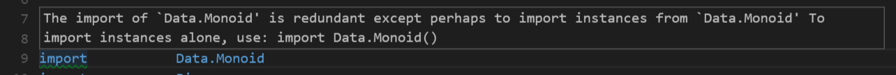
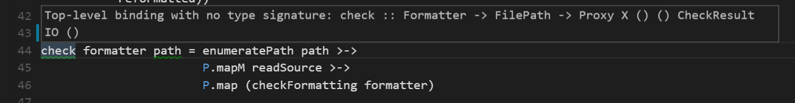
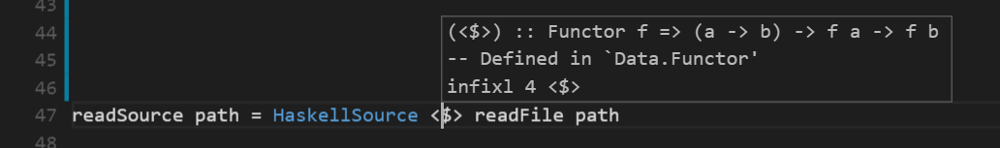
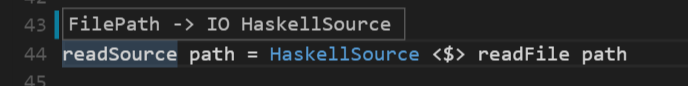

# vscode-ghc-mod
This exension exposes ghc-mod functionality to VS Code. It requires having ghc-mod installed. I installed it on Windows via `cabal` using [these instructions][ghc-mod-instructions] and it is working.

It currently supports `check` on the fly and `type` and `info` when hovering the mouse.

For linting, please use the [haskell-linter extension][haskell-linter-extension].

## Pictures
### Check
Example 1:

Example 2:  


### Info


### Type


## Configuration:
The following options can be set in workspace or user preferences:
```json
"haskell.ghcMod.maxNumberOfProblems": {
    "type": "number",
    "default": 100,
    "maximum": 100,
    "description": "Controls the maximum number of problems reported."
},
"haskell.ghcMod.executablePath": {
    "type": "string",
    "default": "ghc-mod",
    "description": "The full path to the ghc-mod executable."
},
"haskell.ghcMod.onHover": {
    "type": "string",
    "enum": [
        "info",
        "type",
        "fallback",
        "none"
    ],
    "default": "fallback",
    "description": "Controls the onHover behavior. 'info' will display ghc-mod info, 'type' will display ghc-mod type, 'fallback' will try info and fallback to type,and 'none' will disable onHover tooltips."
},
"haskell.ghcMod.check": {
    "type": "boolean",
    "default": true,
    "description": "Controls whether ghc-mod check is enabled or not" 
},
"haskell.ghcMod.logLevel": {
    "type": "string",
    "enum": [
        "none",
        "log",
        "info",
        "warn",
        "error"
    ],
    "default": "error",
    "description": "Controls the verbosity of logging. Logs can be seen in the console by opening the dev tools."
}
```

[ghc-mod-instructions]: http://www.mew.org/~kazu/proj/ghc-mod/en/install.html
[haskell-linter-extension]: https://marketplace.visualstudio.com/items/hoovercj.haskell-linter
